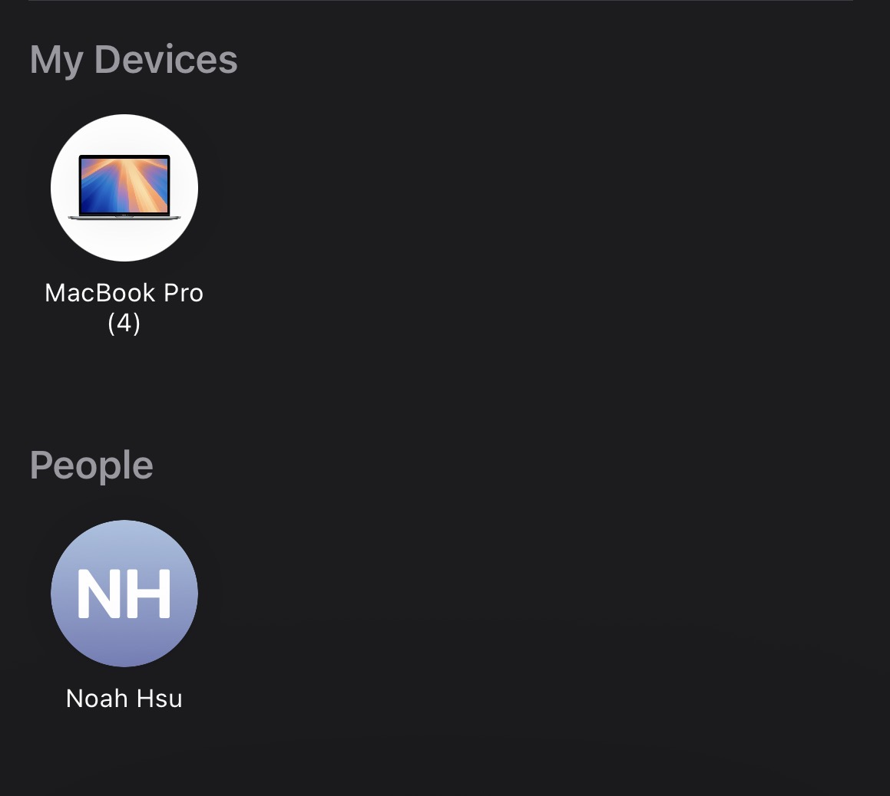

# First UX Journal

## The Situation
Recently I went on a ski trip and on this trip we did what a lot of college kids do and took lots of photos. Everybody loves having photos to commemorate a fun night and the new friends they made. The only problem is photos are just taken on one device and everybody wants them. Most of the solutions are super clunky. You have to upload it to a service like google drive and share around a link which takes awhile. Then you also have to download those photos again. This time we just used an airdrop which was way faster and intuitive. Thirty photos, two taps and then we were done in around 15 seconds. 
## The interaction
Everybody opened up their phones, selected all of the photos they wanted to share and then hit the share icon and all available devices for airdrop popped up. There was no searching, no collecting everyone’s email address, no friction at all. A notification then pops up on everyone’s phone and they click accept, boom done.

Above is an example of the screen that shows up for the photo sharer, they just have to click one of the icons and it sends the notification and transfers the photos. It also uses bluetooth which makes the photo transfer faster.

## UX Analysis
One of the reasons that airdrop works so fantastically is that it maps directly onto the **mental model** people already have when sharing things. When you share something with someone you collect that thing and then you give it to them. Sharing a book? Pick up the book and hand it to someone. Airdrop mimics that, the person is near you and you select the photos (collecting) and then tap their contact (handing it). It also does a great job with **affordances** signaling as to what everything does. When you hit the share button the airdrop recipients pop up as these circular contact bubbles that just look clickable. Airdrop is very **effective** at its job, far more **efficient** than other methods. It is also very **satisfying** to use with the vibrations and just the ease of use makes it feel like magic. The only UX area it falls short is **error tolerance**. If your recipient is not on apple it cannot be used, so it just does not work. Overall it does a great job being intuitive and easy to use, a great product.  
